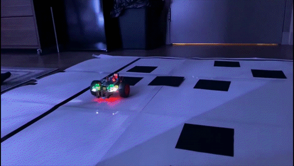

# LooRiders
Project for SE101

## What is LooRider
 LooRider is a two wheel self-driving arduino car which finds the shortest path from its initial position to its destination on a changeable map.

  
## Software Components
* Image localization and processing of a physical maze(grid)
* Car's path finding Program using A*star path finding algorithm
* A data translation script that translates the directions developed in Python to C# for the Arduino to function

## Hardware Components
* Arduino Uno: Processes and receives information from the processed grid to map a suitable path for the car
* Arduino two wheel car: Construct a function car with turning capabilities

## How does it work?

- A picture is taken from the physical map with the car and the obstacles on the map.

- The pictures is process by LooRdier's image localization and detection algorithm that uses **OpenCV** and **Imutiles** python libraries.

  - The algorithm uses OpenCV to localize the map by finding the biggest square in the map.
  - Upon localizing the map, the algorithm divides the map into 36 cells and uses Imutiles to determine wether they are white (a possible path) or black (an obstacle that the car     should avoid).
  - After processing the image the algorithm passes the data collected, to LooRider's Path Finding program.
  
- The passed data, is used to construct a visual grid in Pygame and execute A* path finding algorithm to find the optimal shortest path.

- Upon finding the path, the path is passed to a python translation layer in format of an array of directions.

- The python script processes the directions, automatically converts them to C# functions and stores the data in a C# file.

- Then, the C# file is sent to the LooRider's Arduino Uno Board and the car starts moving in the desired path.

## License

[MIT](https://choosealicense.com/licenses/mit/)